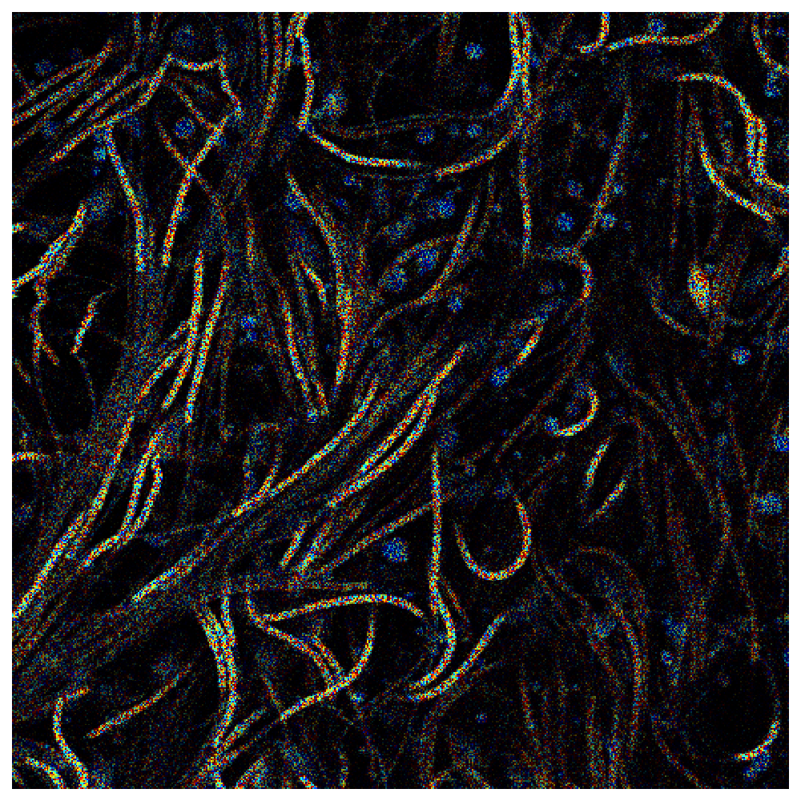
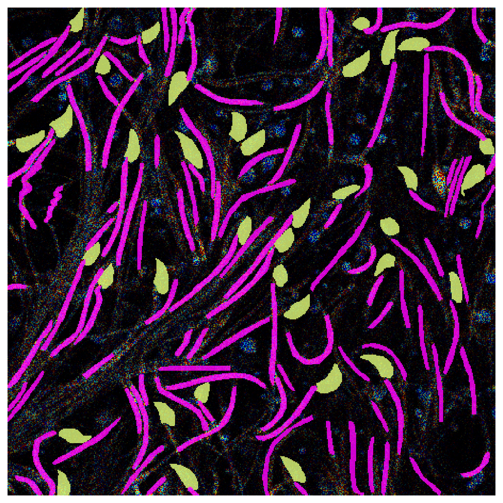
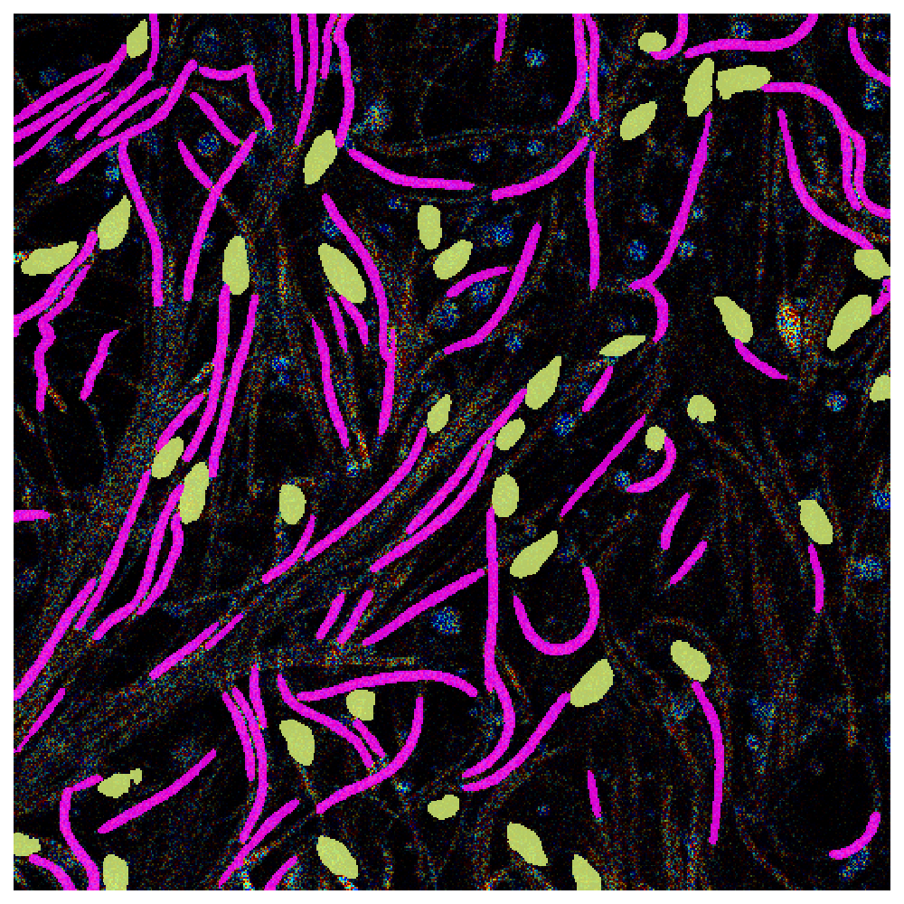

# Label-free metabolic fingerprinting of motile mammalian spermatozoa with subcellular resolution

<p align="left">
    <a href="https://www.python.org/">
      </a>
    <a href= "https://tensorflow.org/">
      </a>
    <a href="https://doi.org/10.5281/zenodo.14006098">
    </a>
        <a href="">
    </a>
</a>
</p>

U-Net segmentation pipeline to segment the head and midpiece of sperm from images of mouse spermal cells from fluorescence lifetime imaging microscope (FLIM). 

<table>
  <tr>
	<td>Input image</td>
        <td>Manual masks</td>
        <td>Predicted masks</td>
  </tr>
  <tr>
    <td style="background-color:#ffffff;"></td>
    <td style="background-color:#ffffff;"></td>
    <td style="background-color:#ffffff;"></td>
   </tr> 
</table>

### Installation

You can install cellpose using conda or with native python. To create a conda environment run:
~~~sh
conda env create -f environments.yaml
~~~
For GPU support change `tensorflow==2.3.0` for `tensorflow-gpu==2.3.0`.

### Training and inference

Train a model using ```train.py``` on [the full published dataset](https://doi.org/10.5281/zenodo.14006098).

Run inference using the attached trained model (in the folder `model`) by `predict.py` or more interactively `inference.ipynb`, sample test images attached ([full dataset](https://doi.org/10.5281/zenodo.14006098)). 

### Citation

```latex
@article{kusari2025,
  title={Label-free metabolic fingerprinting of motile mammalian spermatozoa with subcellular resolution},
  author={Kusari, F, Backov{\'a}, Lenka and P{\'a}nek, Dalibor and Benda, Ale{\v{s}} and Trachtulec, Zden\v{e}k},
  pages={60--66},
  year={2025},
  publisher={BMC Biology}
}
```

